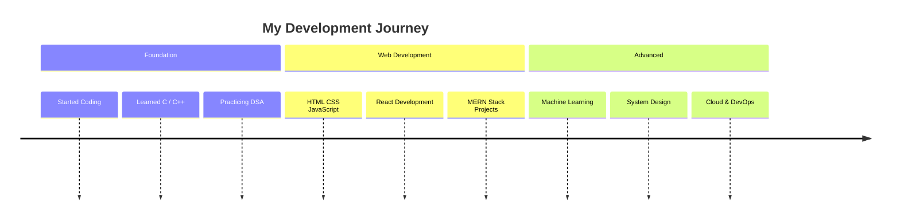

<div align="center">


### 🚀 MERN Stack Developer | ML Enthusiast | DSA in C++


</div>

---

# 👋 Hello World! I'm Subham

<table>
<tr>
<td width="50%">

🚀 MERN Stack Developer passionate about building scalable applications

🧠 Practicing **DSA in C++**

🌱 Currently learning **Machine Learning & Advanced Backend**

🤝 Open to **Internships & Open Source**

⚡ Interests: **Sports | Gaming | Technology**

</td>

<td width="50%">


</td>
</tr>
</table>

---

# 🧠 Developer Profile

```javascript
const subham = {
  role: "Full Stack MERN Developer",
  currentlyWorkingOn: ["MERN Projects", "Machine Learning"],
  practicing: "DSA in C++",
  learning: ["System Design", "Cloud"],
  interests: ["Web Development", "AI", "Open Source"],
  location: "India",
  openTo: ["Internships", "Open Source"]
}
```

---

# 🚀 My Coding Journey



---

# 💻 Tech Stack

## 👨‍💻 Languages


---

## 🎨 Frontend


---

## ⚙ Backend


---

## 🗄 Databases


---

## 🔧 Tools


---

# 🚀 Featured Projects

### 🔍 Deep Packet Inspection (DPI) Packet Analyzer

**Networking & Systems Project**

• Built a **C++ Deep Packet Inspection engine** to analyze PCAP traffic and classify applications.
• Implemented **Ethernet, IP, TCP, and UDP protocol parsing** with multi-threaded packet processing.
• Designed the system for **efficient network traffic inspection and protocol-level analysis**.

**Tech Stack:**
`C++` • `Networking Protocols` • `PCAP Processing` • `Multithreading` • `CMake`

---

### 🌐 MERN Stack CRUD Web Application

**Full Stack Web Development Project**

• Developed a **MERN CRUD application** with RESTful APIs using **Node.js and Express.js**.
• Integrated **MongoDB with Mongoose** for schema-based data management.
• Implemented **React frontend with Axios** for API communication.

**Tech Stack:**
`MongoDB` • `Express.js` • `React.js` • `Node.js` • `Axios`

---

### 🧠 Customer Segmentation using Machine Learning

**Machine Learning Project**

• Applied **K-Means clustering** to segment customers based on purchasing behavior.
• Performed **data preprocessing and visualization** to discover behavioral patterns.
• Built an **interactive dashboard using Streamlit** for analysis.

**Tech Stack:**
`Python` • `Pandas` • `NumPy` • `Scikit-learn` • `Matplotlib` • `Streamlit`

---

# 🌐 Connect With Me

<p align="center">

<a href="https://instagram.com/shubhammm.14">

</a>

<a href="https://www.linkedin.com/in/subham-guha">

</a>

<a href="mailto:opsubham609@gmail.com">

</a>

</p>

---

# 🐍 Contribution Snake

<picture>
  <source media="(prefers-color-scheme: dark)" srcset="https://raw.githubusercontent.com/subhamguhagithub/subhamguhagithub/output/github-contribution-grid-snake-dark.svg">
  
</picture>

---

# 📊 GitHub Stats

<p align="center">


</p>

---

# 📈 Contribution Graph


---

# ✨ Random Dev Quote


---

<p align="center">


</p>
